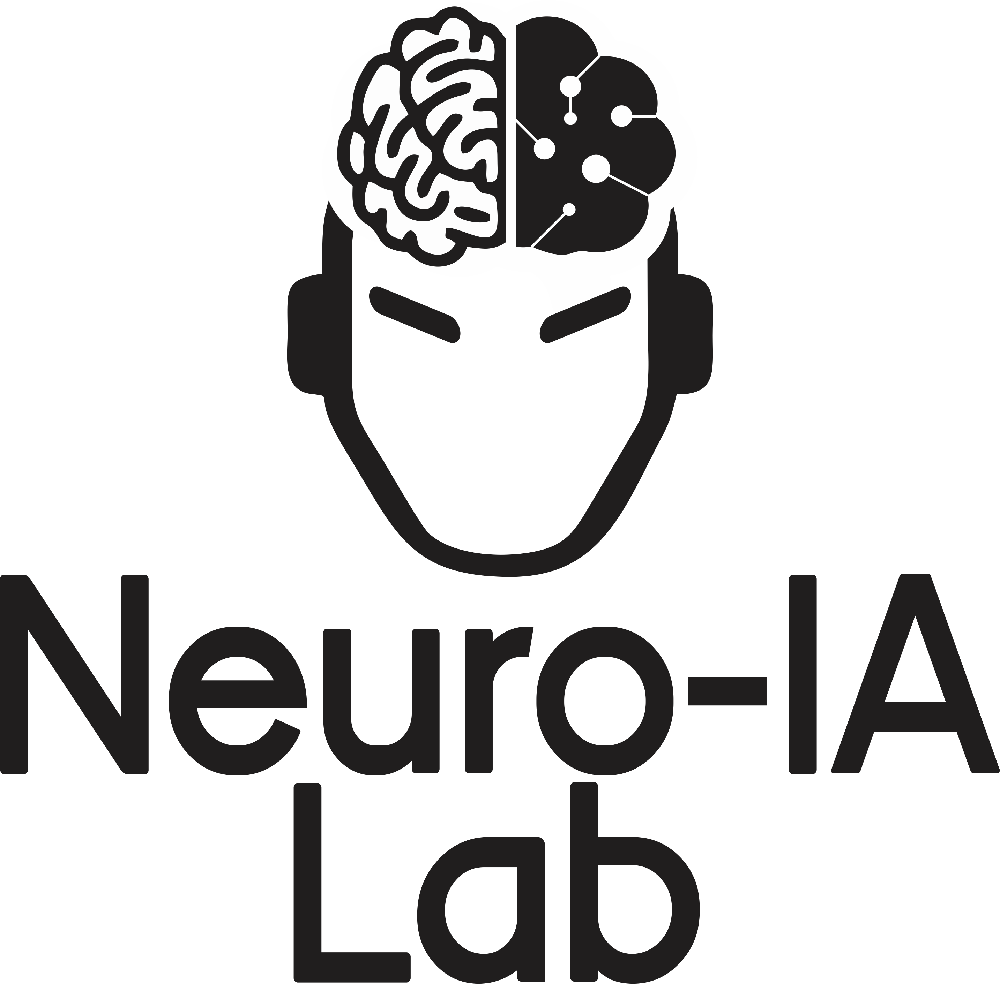
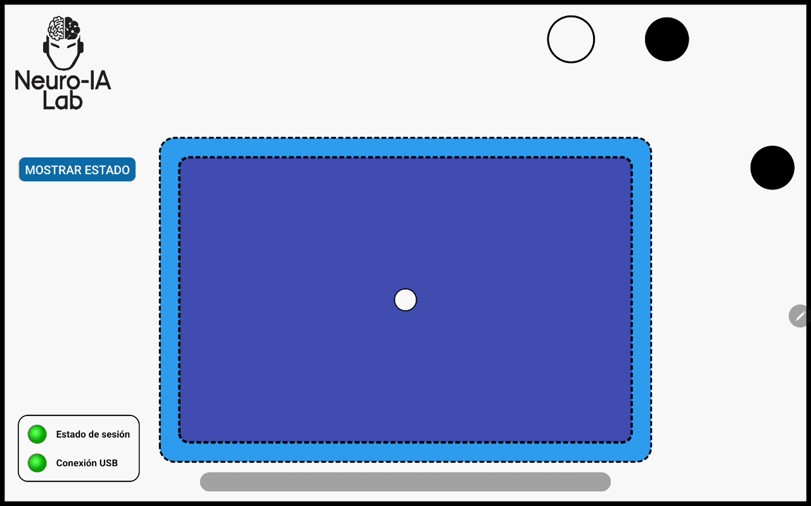

# ✍️ Handwriting Project (Android Kotlin) ✍️



La aplicación funciona como interfaz de presentación de estímulos, sistema de captura de eventos del lápiz y módulo de registro de la información generada durante cada trial. Esta aplicación es controlada por [pyhwr](https://github.com/neuroialaborg/pyhwr) desde una PC/Laptop usando Python.

Esta app es parte del proyecto para estudiar la factibilidad de decodificación del trazo continuo de letras del alfabeto español a partir del electroencefalograma de superficie que se lleva a cabo en el Laboratorio de Neurociencias e Inteligencia Artificial aplicada (Neuro-IA LAB) de la [Universidad Tecnológica](https://utec.edu.uy/es/) del Uruguay.

## Autor MSc. BALDEZZARI LUCAS

💻 Github: [lucasbaldezzari](https://github.com/lucasbaldezzari)

📄 CVUY: [CV Lucas Baldezzari](https://exportcvuy.anii.org.uy/cv/?ce2da83661958a08b41a1469b83e1d91)

🟦 Linkedin: [Lucas Baldezzari](https://www.linkedin.com/in/lucasbaldezzari)


### ❗️IMPORTANTE❗️

La aplicación de la tablet será sincronizada en este repositorio de manera completa una vez publicada la base de datos. Se espera que la publicación esté lista a finales de 2026.

---

## Estado actual

La versión actual permite:

✅ Ejecutar una interfaz Android en orientación horizontal y pantalla completa.

✅ Recibir comandos desde una PC mediante broadcasts ADB con payload JSON.

✅ Controlar el estado general de la sesión: `standby`, `on`, `off` y `final`.

✅ Controlar fases del trial: `start`, `precue`, `cue`, `fadeoff`, `rest` y `trialInfo`.

✅ Mostrar una letra objetivo durante la fase `cue`.

✅ Mostrar un punto de fijación central durante las fases sin estímulo.

✅ Registrar eventos del lápiz: `pen-down`, `pen-move` y `pen-up`.

✅ Registrar coordenadas `(x, y)` y timestamps asociados al trazo.

✅ Guardar la información de cada trial como archivo JSON.

✅ Reproducir un sonido durante `precue` y otro al finalizar la sesión.

✅ Mostrar indicadores visuales tipo LED para estado de sesión y conexión.

✅ Mostrar u ocultar un panel de depuración con estado de sesión y coordenadas.

✅ Generar marcadores visuales para inicio de sesión, trial y primer contacto del lápiz. Estos marcadores son registrados usando triggers digitales que se sincronizan con las señales adquiridas con el amplificador. También se registran los eventos por software para tener redundancia de información.

### Demostración

El gif de abajo muestra la aplicación en funcionamiento. Los trazos son dibujados por una persona voluntaria y la tablet registra toda la información necesaria para el posterior análisis.

<p align="center">
  <a href="figuras/demo_gif.gif">
    
  </a>
</p>

---

## Uso general

El flujo esperado es el siguiente:

1. Una PC controla la sesión experimental.
2. La PC envía mensajes JSON a la tablet indicando el estado de la sesión y la fase actual del trial.
3. La tablet actualiza la interfaz según el mensaje recibido.
4. Durante `cue`, la persona escribe la letra indicada en el área de escritura.
5. La tablet registra coordenadas, timestamps y eventos del lápiz.
6. Al recibir `trialInfo`, la tablet consolida la información del trial y la guarda como JSON. Además, envía el JSON a la PC donde también se almacena junto a otros eventos marcados por la app *pyhwr*.
7. Al recibir `final`, la tablet guarda una marca de cierre, reproduce un sonido y detiene procesos activos.

La aplicación fue pensada para integrarse con el amplificador que se cuenta en el Neuro-IA LAB, donde es importante conservar tiempos, eventos externos y marcadores que permitan sincronizar posteriormente la señal cerebral con los trazos realizados por la persona voluntaria.

---

## Arquitectura general

| Componente | Archivo | Responsabilidad |
|---|---|---|
| `MainActivity` | `MainActivity.kt` | Coordina la interfaz, los estados de sesión, las fases del trial, el guardado de datos y la comunicación con `PCMessenger`. |
| `TouchView` | `touchView.kt` | Vista personalizada de escritura. Captura coordenadas, eventos de lápiz, timestamps y controla el punto de fijación. |
| `PCMessenger` | `PCMessenger.kt` | Recibe mensajes JSON desde la PC mediante broadcasts ADB y mantiene el último mensaje recibido. También incluye utilidades para enviar información por Logcat. |
| `EventManager` | `EventManager.kt` | Almacena temporalmente IDs de trial, timestamps de fases, eventos de lápiz y coordenadas. |

---

## Estructura del repositorio

```text
.
├── readme.md
├── Docs/
│   ├── datos_a_almacenar.md
│   ├── especificaciones_interfaz.md
│   ├── etapas_experimento.md
│   ├── protocolo_comunicacion.md
│   ├── protocolo_registro_eventos.md
│   ├── requisitos_androidstudio.md
│   └── trama_pcyandroid.md
├── figuras/
│   ├── esquema_app.png
│   └── trials_division.png
├── handwrittingrecording/
│   ├── build.gradle.kts
│   ├── settings.gradle.kts
│   ├── gradle/
│   └── app/
│       ├── build.gradle.kts
│       └── src/main/
│           ├── AndroidManifest.xml
│           ├── java/com/example/handwrittingrecording/
│           │   ├── EventManager.kt
│           │   ├── MainActivity.kt
│           │   ├── PCMessenger.kt
│           │   └── touchView.kt
│           └── res/
│               ├── drawable/
│               ├── font/
│               ├── layout/activity_main.xml
│               ├── raw/
│               └── values/
└── pc/
    └── empty.txt
```

---

## Requisitos

### Software

- Android Studio.
- Android SDK compatible con `compileSdk = 36`.
- Kotlin `2.0.21`.
- Android Gradle Plugin `8.11.1`.
- ADB disponible en la PC para enviar mensajes a la tablet.

### Dispositivo objetivo

El diseño fue pensado para una tablet grande en orientación horizontal, particularmente una Samsung Galaxy Tab S9 Ultra o un dispositivo de tamaño similar.

### Configuración Android actual

```kotlin
compileSdk = 36
minSdk = 34
targetSdk = 36
versionCode = 1
versionName = "1.0"
applicationId = "com.example.handwrittingrecording"
```

---

## Instalación y ejecución

1. Clonar el repositorio.
2. Abrir Android Studio.
3. Abrir la carpeta del proyecto Android:

```text
handwrittingrecording/
```

4. Esperar la sincronización de Gradle.
5. Conectar la tablet por USB.
6. Habilitar en la tablet:
   - Opciones de desarrollador.
   - Depuración USB.
7. Verificar que ADB detecta el dispositivo:

```bash
adb devices
```

8. Ejecutar la aplicación desde Android Studio.

Si hay más de un dispositivo conectado, usar el serial correspondiente:

```bash
adb -s SERIAL_DEL_DISPOSITIVO devices
```

---

## Comunicación PC → tablet

La app recibe mensajes mediante un broadcast Android con la siguiente acción:

```text
com.handwriting.ACTION_MSG
```

El mensaje debe enviarse como extra llamado `payload`, cuyo contenido debe ser un JSON serializado como string.

La clase `PCMessenger` recibe el mensaje, lo intenta interpretar como `JSONObject` y lo deja disponible en:

```kotlin
pcMessenger.latestMessage
```

`MainActivity` consulta periódicamente ese último mensaje y actualiza la sesión o el trial según su contenido.

---

## Formato general del payload

```json
{
  "sesionStatus": "on",
  "session_id": "1",
  "run_id": "1",
  "subject_id": "S01",
  "sessionStartTime": 1712345678901,
  "trialInfo": {
    "trialID": 1,
    "trialPhase": "cue",
    "letter": "a",
    "duration": 2.0
    }
}
```

### Campos principales

| Campo | Tipo | Descripción |
|---|---:|---|
| `sesionStatus` | `String` | Estado general de la sesión: `standby`, `on`, `off` o `final`. |
| `session_id` | `String` | Identificador de sesión. Se usa para construir la ruta de guardado. |
| `run_id` | `String` | Identificador del run. Se usa para construir la ruta de guardado. |
| `subject_id` | `String` | Identificador de la persona participante. Se usa para construir la ruta de guardado. |
| `sessionStartTime` | `Long` | Timestamp de inicio generado por la PC. Es obligatorio al iniciar con `sesionStatus = "on"`. |
| `trialInfo` | `Object` | Información del trial actual. |
| `mensaje_a_usuario` | `String` | Mensaje opcional asociado al estado o fase actual. |

### Campos de `trialInfo`

| Campo | Tipo | Descripción |
|---|---:|---|
| `trialID` | `Int` | Identificador numérico del trial. |
| `trialPhase` | `String` | Fase actual del trial. |
| `letter` | `String` | Letra o estímulo mostrado durante `cue`. |
| `duration` | `Double` | Duración esperada de la fase, en segundos. Actualmente la PC controla el avance entre fases. |

---

## Estados de sesión

| Estado | Efecto |
|---|---|
| `standby` | Deja la app en espera, cambia LEDs a gris y muestra mensaje de espera. |
| `on` | Activa la sesión. Requiere `sessionStartTime`. Permite procesar fases del trial. |
| `off` | Finaliza la sesión, limpia la pantalla y guarda un JSON de cierre. |
| `final` | Finaliza la sesión, guarda JSON de cierre, reproduce sonido de éxito y detiene procesos activos. |

Cuando la sesión pasa a `on`, la app usa `sessionStartTime` como referencia temporal enviada por la PC:

```kotlin
t0Laptop = mensaje_pc.optLong("sessionStartTime")
t0TabletNano = System.nanoTime()
```

Los tiempos locales posteriores se calculan como:

```kotlin
t0Laptop + (System.nanoTime() - t0TabletNano) / 1_000_000
```

Así, los timestamps generados por la tablet quedan expresados en una escala temporal vinculada a la PC.

---

## Fases del trial

| Fase | Efecto principal |
|---|---|
| `start` | Registra `trialStartTime`, limpia la pantalla e inicia un nuevo trial. |
| `precue` | Registra `trialPrecueTime`, reproduce un sonido y mantiene el punto de fijación. |
| `cue` | Registra `trialCueTime`, muestra la letra, oculta el punto de fijación, habilita dibujo e inicia muestreo. |
| `fadeoff` | Registra `trialFadeOffTime`, limpia pantalla, deshabilita dibujo y vuelve a mostrar el punto de fijación. |
| `rest` | Registra `trialRestTime`, limpia pantalla y muestra mensaje de descanso. |
| `trialInfo` | Recupera coordenadas/eventos, construye el JSON y guarda el trial. |

---

## Registro del trazo

La captura de trazos se implementa en `TouchView`.

Durante `cue`, `MainActivity` ejecuta:

```kotlin
touchView.clearPath()
touchView.enableDrawing(true)
touchView.startSampling()
```

`TouchView` registra:

- Coordenada `x`.
- Coordenada `y`.
- Timestamp.
- Eventos `ACTION_DOWN` como `penDownTimestamps`.
- Eventos `ACTION_UP` o `ACTION_CANCEL` como `penUpTimestamps`.
- Trayectoria dibujada en pantalla mediante un `Path`.

---

## Archivos de salida

Cada trial se guarda como archivo JSON en la carpeta pública `Documents` del dispositivo Android.

Ruta generada:

```text
/storage/emulated/0/Documents/{subject_id}/{session_id}/{run_id}/trial_{trialID}.json
```

Ejemplo:

```text
/storage/emulated/0/Documents/S01/1/1/trial_1.json
```

El guardado se realiza desde:

```kotlin
MainActivity.saveTrialInfo()
```

---

## Estructura del JSON guardado

Ejemplo de salida:

```json
{
  "trialID": 1,
  "letter": "a",
  "runID": "1",
  "sessionStartTime": 1712345678901,
  "trialStartTime": 1712345679500,
  "trialPrecueTime": 1712345680000,
  "trialCueTime": 1712345682000,
  "trialFadeOffTime": 1712345684000,
  "trialRestTime": 1712345686000,
  "penDownMarkers": [1712345682301],
  "penUpMarkers": [1712345683100],
  "coordinates": [
    [500.2, 320.4, 1712345682301],
    [501.1, 321.0, 1712345682310],
    [502.0, 322.5, 1712345682320]
  ],
  "sessionFinalTime": 1712345689000
}
```

| Campo | Descripción |
|---|---|
| `trialID` | Identificador del trial. |
| `letter` | Letra presentada durante `cue`. |
| `runID` | Identificador del run. |
| `sessionStartTime` | Timestamp de inicio de sesión recibido desde la PC. |
| `trialStartTime` | Timestamp de inicio del trial. |
| `trialPrecueTime` | Timestamp de inicio de `precue`. |
| `trialCueTime` | Timestamp de inicio de `cue`. |
| `trialFadeOffTime` | Timestamp de inicio de `fadeoff`. |
| `trialRestTime` | Timestamp de inicio de `rest`. |
| `penDownMarkers` | Timestamps donde el lápiz tocó la pantalla. |
| `penUpMarkers` | Timestamps donde el lápiz dejó de tocar la pantalla. |
| `coordinates` | Lista de tripletas `[x, y, timestamp]`. |
| `sessionFinalTime` | Timestamp de cierre o finalización. |

---

## Recuperar archivos desde la tablet

Listar archivos:

```bash
adb shell ls /storage/emulated/0/Documents/S01/1/1/
```

Copiar un trial a la PC:

```bash
adb pull /storage/emulated/0/Documents/S01/1/1/trial_1.json .
```

Copiar un run completo:

```bash
adb pull /storage/emulated/0/Documents/S01/1/1 ./datos_trial
```

---

## Interfaz gráfica

La interfaz contiene:

- Logo del laboratorio.
- Botón para mostrar u ocultar información de estado.
- Panel de estado de sesión y coordenadas.
- Área central de escritura.
- Letra objetivo durante `cue`.
- Punto de fijación central cuando corresponde.
- Barra de progreso horizontal.
- Marcadores visuales de inicio de sesión, trial y pen-down.
- Indicadores LED de sesión y conexión USB.

Imagen de referencia:

<p align="center">
  
</p>

---

## Etapas experimentales previstas

Las letras que se muestran son:

```text
e, a, o, s, n, r, u, l, d, m
```

La estructura general esperada para un trial es:

1. `start`
2. `precue`
3. `cue`
4. `fadeoff`
5. `rest`
6. `trialInfo`

Imagen de referencia:

<p align="center">
  
</p>

---

## Logs útiles

| Tag | Uso |
|---|---|
| `MainActivity` | Estado general de la app, errores de sincronización, guardado de archivos y ciclo de vida. |
| `PCMessenger` | Recepción e interpretación de mensajes desde la PC. |
| `LaptopLucas` | Tag definido en `PCMessenger.DEFAULT_PC_TAG` para enviar información hacia la PC por Logcat. |
| `TouchView` | Guardado local de trazos cuando se usa `saveToJson()`. |

Monitorear recepción de mensajes:

```bash
adb logcat -s PCMessenger MainActivity
```

Filtrar mensajes emitidos hacia la PC mediante Logcat:

```bash
adb logcat -s LaptopLucas
```

---

## Consideraciones técnicas importantes

### Almacenamiento en `Documents`

El guardado actual usa:

```kotlin
Environment.getExternalStoragePublicDirectory(Environment.DIRECTORY_DOCUMENTS)
```

En versiones recientes de Android, la escritura en carpetas públicas puede requerir ajustes adicionales según políticas de almacenamiento, permisos y configuración del dispositivo. Si aparecen errores de escritura. En caso de cambiar de SDK esto traerá un problema, por lo tanto, **recomiendo fuertemente usar JDK 17 como en este proyecto.**

---

## Licencia

**COLOCAR**